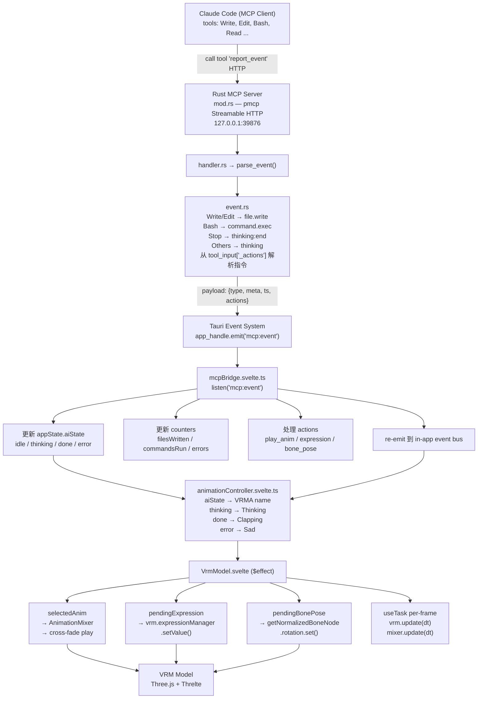
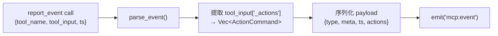
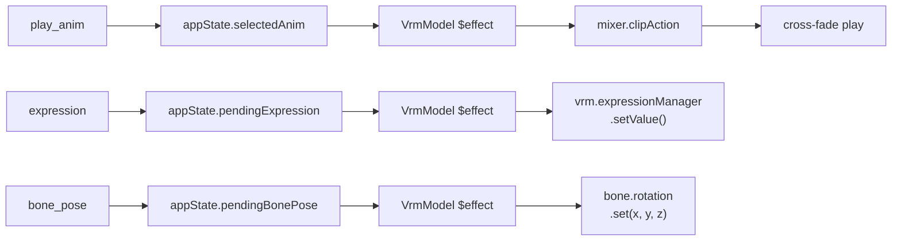

# Vibe Break — 架构文档

版本：2.0（实际代码状态）

---

## 目标

把 Claude Code（或其它 MCP 客户端）的事件流接入 Vibe Break，把 AI 的内部状态（thinking / file.write / command.exec / done / error / progress）实时可视化，并通过 `_actions` 指令控制 VRM 模型的动作（动画播放、表情 BlendShape、Bone 姿势）。

---

## 当前架构（已实现）



## 已实现功能

### Core 渲染
- VRM 模型加载（两步：fetch → yield → parse）
- VRMA 动画加载（clip 缓存、交叉淡入淡出 0.2s）
- 四点光源、透明窗口、ACES Filmic Tone Mapping
- 相机自动取景（head/foot 骨骼计算距离）
- 窗口跟随缩放（滚轮缩放模型+窗口，3:4 比例锁定）
- long-press 窗口拖拽（Tauri startDragging）

### MCP 集成
- MCP HTTP 服务器（127.0.0.1:39876, Streamable HTTP）
- 注册 `report_event` tool（接受 tool_name, tool_input, ts）
- 事件映射（Write/Edit/Bash/Stop → file.write/command.exec/thinking:end）
- 动作指令（`_actions` 数组）：play_anim / expression / bone_pose
- 9 个单元测试覆盖事件解析

### 动画控制
- aiState 驱动动画自动切换（Thinking / Cladding / Sad）
- 动画 ping-pong 循环（避免 A-pose 闪回）
- 表情 BlendShape 控制（vrm.expressionManager）
- Bone 姿势控制（getNormalizedBoneNode）

### UI
- 右键/双击上下文菜单
- 模型/动画选择器、重播/停止
- 置顶开关、状态文本
- 持久化（settings.json: selectedVrm, selectedAnim, petScale, alwaysOnTop）

---

## 事件协议

### MCP → Vibe Break

Claude Code 调用 `report_event` tool：

```json
{
  "tool_name": "Write",
  "tool_input": {
    "file_path": "src/foo.ts",
    "_actions": [
      { "type": "play_anim", "name": "Clapping", "speed": 1.2 },
      { "type": "expression", "name": "happy", "weight": 0.8 },
      { "type": "bone_pose", "bone": "head", "x": 0.3, "y": 0, "z": 0 }
    ]
  },
  "ts": 1680000000000
}
```

### 事件类型

| tool_name | event_type | 说明 |
|-----------|------------|------|
| Write / Edit | `file.write` | 文件写入 |
| Bash | `command.exec` | 命令执行 |
| Stop | `thinking:end` | 思考结束 |
| 其他（Read, Glob, Grep, Search...） | `thinking` | 思考中 |
| （通过 tool_name 透传） | `done` | 任务完成 |
| （通过 tool_name 透传） | `error` | 错误 |
| （通过 tool_name 透传） | `progress` | 进度（当前 no-op） |

### 动作指令 (`_actions`)

| type | 字段 | 作用 |
|------|------|------|
| `play_anim` | `name` / `url`, `speed?` | 播放指定 VRMA 动画 |
| `expression` | `name`, `weight` | 设置面部表情（BlendShape） |
| `bone_pose` | `bone`, `x`, `y`, `z` | 控制骨骼旋转（Euler 角度） |

---

## 核心模块

### Rust 后端 (`src-tauri/src/`)

| 文件 | 职责 |
|------|------|
| `main.rs` | 入口，调用 lib::run() |
| `lib.rs` | Tauri Builder, asset 扫描, aspect-ratio 锁定, MCP server 启动 |
| `mcp_server/mod.rs` | MCP HTTP server (pmcp), 注册 report_event tool |
| `mcp_server/handler.rs` | 接收 tool call, 解析事件, emit 到前端 |
| `mcp_server/event.rs` | 事件/动作类型定义, parse_event() 映射逻辑 |

### 前端 (`src/lib/`)

| 文件 | 职责 |
|------|------|
| `stores.svelte.ts` | 全局响应式状态（aiState, counters, actions, ...） |
| `eventBus.svelte.ts` | 类型化事件总线（mitt） |
| `mcpBridge.svelte.ts` | Tauri event listener → appState 更新 |
| `animationController.svelte.ts` | aiState → VRMA name 映射 |
| `three/useVrm.ts` | VRM/VRMA 加载管线（fetch → parse → dispose） |
| `persisted.ts` | 设置持久化（@tauri-apps/plugin-store） |
| `runtime.ts` | 运行时检测（isTauri, invoke, convertFileSrc） |

### 前端组件 (`src/components/`)

| 文件 | 职责 |
|------|------|
| `Scene/VrmModel.svelte` | VRM 渲染、动画播放、表情/Bone 控制 |
| `Scene/CameraRig.svelte` | 相机、鼠标跟踪、窗口拖拽 |
| `Scene/OrbitControls.svelte` | 轨道控制（交互禁用，仅用阻尼） |
| `Scene/Lighting.svelte` | 四点光源 |
| `Scene/Scene.svelte` | 场景编排 |
| `VrmViewer.svelte` | 顶层容器（场景 + UI） |
| `UI/` | 上下文菜单、选择器等 |

---

## 未实现 / 计划中

| 功能 | 状态 | 说明 |
|------|------|------|
| **MCP UI 可视化面板** | ❌ | counters、thinkingPeriods 存在于 store 但无 UI 渲染 |
| **news 轮播** | ❌ | store 定义了 NewsItem 但无抓取逻辑和 UI |
| **鼓励/错误弹窗** | ❌ | mcpUi.showEncouragement / showErrorFeedback 定义了但无 UI |
| **progress 进度条** | ❌ | 收到 progress 事件后 no-op |
| **VRM SpringBone 物理** | ❌ | 头发、裙子等次级物理未实现 |
| **文件选择/拖拽导入** | ❌ | 只能加载预打包模型 |
| **设置面板** | ❌ | 无独立设置 UI |
| **多窗口/多宠物** | ❌ | 单窗口 |
| **done/error  tool schema** | ⚠️ | 前端处理了但 MCP tool 描述未枚举，Claude 不会自动调用 |
| **CSP 重复 key** | ⚠️ | tauri.conf.json 中 csp 出现两次 |
| **新闻爬取插件框架** | ⚠️ | 架构已设计，详见 [crawler-plugin.md](./crawler-plugin.md)，待实现 |
| **插件系统** | ❌ | PluginManager、manifest、权限系统均未实现 |

---

## 动效控制 API 设计

### Rust 端



ActionCommand 定义（`event.rs`）：

```rust
pub struct ActionCommand {
    pub action_type: String,    // "play_anim" | "expression" | "bone_pose"
    pub name: Option<String>,   // VRMA name / expression name / bone name
    pub url: Option<String>,    // VRMA URL（可选，替代 name）
    pub speed: Option<f32>,     // 播放速度（仅 play_anim）
    pub weight: Option<f32>,    // 表情权重 0-1（仅 expression）
    pub bone: Option<String>,   // 骨骼名称（仅 bone_pose）
    pub x: Option<f32>,         // Euler X
    pub y: Option<f32>,         // Euler Y
    pub z: Option<f32>,         // Euler Z
}
```

### 前端消费链路



---

## 迭代计划

### M1（✅ 已完成）— 最小可用
- [x] MCP HTTP server (pmcp) + report_event tool
- [x] 前端 mcpBridge 接收事件 → appState.aiState
- [x] 基本 AnimationController（thinking/done/error → VRMA）
- [x] 文件清理（移除 file_path/command 元数据提取）
- [x] 动作指令支持（play_anim / expression / bone_pose）

### M2 — MCP UI 可视化
- [ ] 显示 aiState、counters（filesWritten, commandsRun, errors）
- [ ] thinking period 计时器显示
- [ ] error 反馈弹出（带错误信息）
- [ ] progress 进度条

### M3 — News + 鼓励
- [ ] NewsItem 抓取（插件式框架，详见 [crawler-plugin.md](./crawler-plugin.md)）
- [ ] NewsTicker 轮播 UI
- [ ] 鼓励触发逻辑（写入/命令计数阈值）

### M4 — 插件化
- [ ] PluginManager 框架
- [ ] manifest 声明 + 权限系统
- [ ] 动态加载前端/后端插件
- [ ] 插件管理 UI
