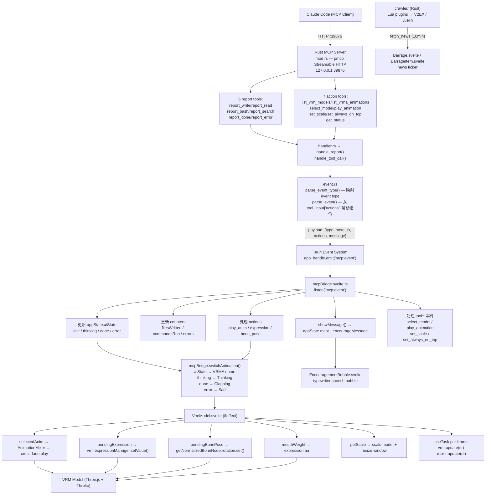
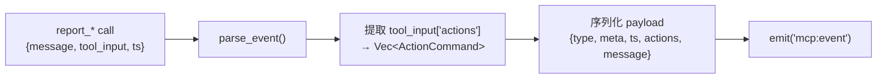
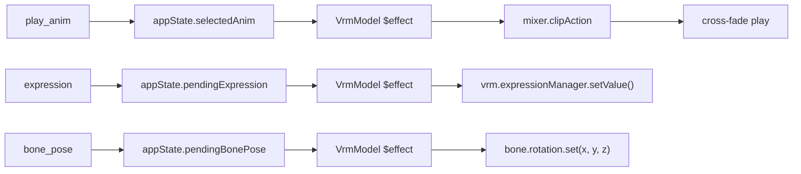

# Vibe Break — 架构文档

版本：3.0（实际代码状态）

---

## 目标

把 Claude Code（或其它 MCP 客户端）的事件流接入 Vibe Break，把 AI 的内部状态（thinking / write / read / bash / search / done / error）实时可视化，通过 `actions` 指令控制 VRM 模型的动作（动画播放、表情 BlendShape、Bone 姿势），并展示社区热点新闻轮播和鼓励气泡。

---

## 当前架构（已实现）



---

## 已实现功能

### Core 渲染
- VRM 模型加载（两步：fetch → yield → parse）
- VRMA 动画加载（clip 缓存、交叉淡入淡出 0.2s、LoopPingPong）
- 四点光源、透明窗口、ACES Filmic Tone Mapping
- 相机自动取景（head/foot 骨骼计算距离）
- 窗口跟随缩放（滚轮缩放模型 + 窗口，3:4 比例锁定）
- long-press 窗口拖拽（Tauri startDragging）

### MCP 集成
- MCP HTTP 服务器（127.0.0.1:39876, Streamable HTTP）
- **6 个 report tool**：report_write / report_read / report_bash / report_search / report_done / report_error
- **7 个 action tool**：list_vrm_models / list_vrma_animations / select_model / play_animation / set_scale / set_always_on_top / get_status
- 事件映射（report_* → trigger:write / trigger:read / trigger:exec / trigger:search / thinking / thinking:end / system:error / system:done）
- 动作指令（`actions` 数组）：play_anim / expression / bone_pose
- `message` 字段支持中文/英文自然语言气泡显示

### 动画控制
- aiState 驱动动画自动切换（Thinking / Clapping / Sad）
- 动画 ping-pong 循环（避免 A-pose 闪回）
- 表情 BlendShape 控制（vrm.expressionManager）
- 嘴部 BlendShape（aa）跟随 EncouragementBubble 打字效果
- Bone 姿势控制（getNormalizedBoneNode）

### 新闻轮播
- **Rust Lua 爬虫引擎**：从 V2EX / 掘金抓取热点
- **DedupCache**：3 天 TTL 去重，JSON 文件持久化
- **Barrage 弹幕**：CSS 动画从右向左滚动，最多 20 条同时显示
- **点击屏蔽**：用户点击弹幕后打开链接并标记已读
- **轮播间隔**：10 分钟拉取一次

### UI
- 右键/双击上下文菜单（模型/动画选择器、重播/停止、置顶开关、计数器）
- **EncouragementBubble 打字机气泡**：MCP message 实时显示，带嘴部联动
- **Barrage 弹幕组件**：带悬停暂停、多轨道随机分配
- 持久化（settings.json: selectedVrm, selectedAnim, petScale, alwaysOnTop）
- 透明无边框窗口

---

## 事件协议

### MCP → Vibe Break

Claude Code 调用 report tool（如 `report_write`）：

```json
{
  "message": "Just wrote the new authentication middleware — 60 lines of TypeScript!",
  "tool_input": {
    "file_path": "src/auth.ts",
    "actions": [
      { "type": "play_anim", "name": "Clapping" },
      { "type": "expression", "name": "happy", "weight": 0.8 },
      { "type": "bone_pose", "bone": "head", "x": 0.3, "y": 0, "z": 0 }
    ]
  },
  "ts": 1680000000000
}
```

### event type 映射

| tool_name | event_type | 说明 |
|-----------|------------|------|
| `report_write` | `trigger:write` | 文件写入 |
| `report_read` | `trigger:read` | 文件读取 |
| `report_bash` | `trigger:exec` | 命令执行 |
| `report_search` | `trigger:search` | 代码搜索 |
| `report_done` | `thinking:end` | 思考结束 |
| `report_error` | `system:error` | 错误 |
| 其他 | `thinking` | 思考中 |
| select_model | `tool:select_model` | 切换模型 |
| play_animation | `tool:play_animation` | 播放动画 |
| set_scale | `tool:set_scale` | 调整缩放 |
| set_always_on_top | `tool:set_always_on_top` | 置顶切换 |

### 动作指令 (`actions` 数组)

| type | 字段 | 作用 |
|------|------|------|
| `play_anim` | `name` / `url` | 播放指定 VRMA 动画 |
| `expression` | `name`, `weight` | 设置面部表情（BlendShape） |
| `bone_pose` | `bone`, `x`, `y`, `z` | 控制骨骼旋转（Euler 角度） |

---

## 核心模块

### Rust 后端 (`src-tauri/src/`)

| 文件 | 职责 |
|------|------|
| `main.rs` | 入口，调用 lib::run() |
| `lib.rs` | Tauri Builder, asset 扫描, aspect-ratio 锁定, MCP server 启动, 3 条 Tauri command |
| `mcp_server/mod.rs` | MCP HTTP server (pmcp), 注册 13 个 tool, server build + start |
| `mcp_server/handler.rs` | handle_report() / handle_tool_call(), 解析事件并 emit 到前端 |
| `mcp_server/event.rs` | ActionCommand 类型定义, parse_event_type() / parse_event() |
| `crawler/mod.rs` | CrawlerPlugin trait, fetch_news() Tauri command |
| `crawler/cache.rs` | DedupCache, 3 天 TTL, JSON 文件去重 |
| `crawler/engine.rs` | LuaEngine, 扫描/加载 crawlers/*.lua 插件 |
| `crawler/plugin.rs` | LuaPlugin, HTTP 请求 + sandboxed Lua parse(), HTML/scraper 注入 |

### 前端 (`src/lib/`)

| 文件 | 职责 |
|------|------|
| `main.ts` | 入口：挂载 VrmViewer, 恢复持久化, 扫描 assets, 启动 MCP bridge, 启动新闻轮询 |
| `stores.svelte.ts` | 全局响应式状态（aiState, counters, news, mcpUi, pendingExpression, ...） |
| `mcpBridge.svelte.ts` | Tauri event listener → appState 更新 + 动作指令处理 |
| `persisted.ts` | 设置持久化（@tauri-apps/plugin-store） |
| `useWindowDrag.svelte.ts` | long-press 窗口拖拽 |
| `three/useVrm.ts` | VRM/VRMA 加载管线（fetch → parse → dispose） |
| `three/loadAssets.ts` | invoke("list_assets") 获取 asset 列表 |
| `three/assetUrl.ts` | 解析 asset:// 协议 URL |
| `logger.ts` | 结构化日志 |
| `strings.ts` | UI 字符串常量 |
| `devLog.ts` | 开发调试日志 |
| `devMock.ts` | 开发模式 mock 数据 |

### 前端组件 (`src/components/`)

| 文件 | 职责 |
|------|------|
| `VrmViewer.svelte` | 顶层容器：Canvas + Scene + Overlay UI, 持久化, 自定义 WebGLRenderer |
| `Scene/Scene.svelte` | 3D 场景编排：CameraRig + Lighting + VrmModel |
| `Scene/VrmModel.svelte` | VRM 加载/渲染、动画播放、表情/Bone/嘴部控制、缩放窗口 |
| `Scene/CameraRig.svelte` | 相机、透明背景、ACESFilmic ToneMapping、窗口拖拽绑定 |
| `Scene/OrbitControls.svelte` | 轨道控制（禁用交互，仅滚轮 → petScale） |
| `Scene/Lighting.svelte` | 四点光源 |
| `UI/VrmContextMenu.svelte` | 右键/双击上下文菜单（模型/动画选择、重播/停止、置顶、计数器） |
| `UI/EncouragementBubble.svelte` | 打字机气泡 + 嘴部 BlendShape 联动 |
| `UI/Barrage.svelte` | 新闻弹幕管理器（20 条上限，点击屏蔽，mock 数据） |
| `UI/BarrageItem.svelte` | 单条弹幕（CSS 滚动、悬停暂停、随机轨道） |

### UI 原语 (`src/lib/components/ui/`)

| 文件 | 职责 |
|------|------|
| `button.svelte` | 按钮组件 |
| `separator.svelte` | 分隔线 |
| `label.svelte` | 标签 |

---

## 未实现 / 计划中

| 功能 | 状态 | 说明 |
|------|------|------|
| **MCP UI 可视化面板** | ❌ | counters、thinkingPeriods 存在于 store 但无独立 UI 面板 |
| **progress 进度条** | ❌ | 收到 system:progress 事件后 no-op |
| **VRM SpringBone 物理** | ❌ | 头发、裙子等次级物理未实现 |
| **文件选择/拖拽导入** | ❌ | 只能加载预打包模型 |
| **设置面板** | ❌ | 无独立设置 UI（设置分散在上下文菜单） |
| **多窗口/多宠物** | ❌ | 单窗口 |
| **CSP 重复 key** | ⚠️ | tauri.conf.json 中 csp 出现两次 |

---

## 动效控制 API 设计

### Rust 端



ActionCommand 定义（`event.rs`）：

```rust
pub struct ActionCommand {
    pub action_type: String,    // "play_anim" | "expression" | "bone_pose"
    pub name: Option<String>,   // VRMA name / expression name / bone name
    pub url: Option<String>,    // VRMA URL（可选，替代 name）
    pub weight: Option<f32>,    // 表情权重 0-1（仅 expression）
    pub bone: Option<String>,   // 骨骼名称（仅 bone_pose）
    pub x: Option<f32>,         // Euler X
    pub y: Option<f32>,         // Euler Y
    pub z: Option<f32>,         // Euler Z
}
```

### 前端消费链路



---

## 迭代计划

### M1（✅ 已完成）— 最小可用
- [x] MCP HTTP server (pmcp) + 6 report tools + 7 action tools
- [x] 前端 mcpBridge 接收事件 → appState.aiState + counters + message
- [x] 基本动画映射（thinking/done/error → VRMA）
- [x] 动作指令支持（play_anim / expression / bone_pose）
- [x] EncouragementBubble 打字机气泡
- [x] 新闻 Barrage + Lua 爬虫引擎（V2EX / 掘金）
- [x] 窗口拖拽 + 3:4 比例锁定 + 缩放联动

### M2 — MCP UI 可视化
- [ ] 显示 aiState、counters（filesWritten, commandsRun, errors）
- [ ] thinking period 计时器显示
- [ ] error 反馈弹出（带错误信息）
- [ ] progress 进度条

### M3 — 增强交互
- [ ] VRM SpringBone 物理
- [ ] 文件选择/拖拽导入
- [ ] 设置面板
- [ ] 多窗口/多宠物
